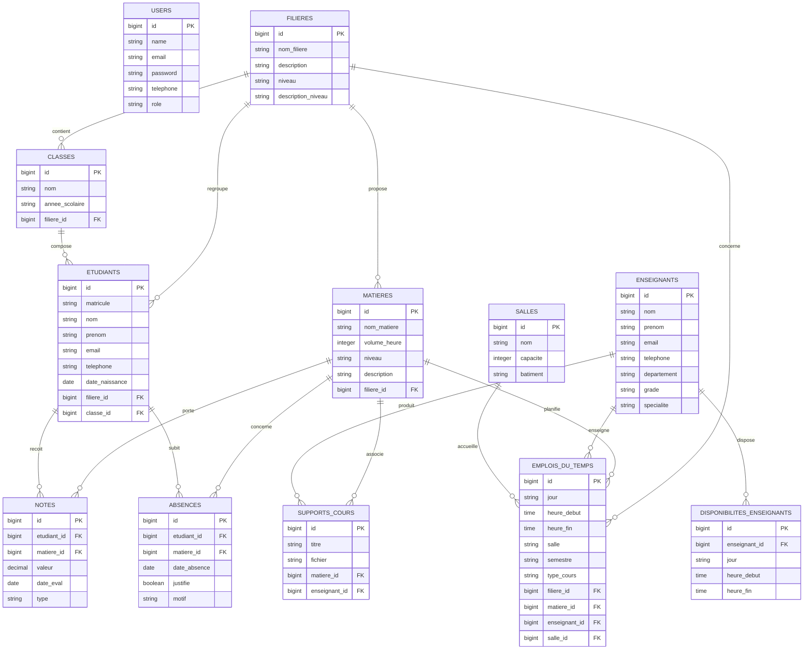

# MCD - Emploi du Temps

Ce modèle conceptuel de données reflète la structure actuelle du projet. Le compte `admin`, `professeur` et `etudiant` est géré dans la table `users` via le champ `role`.

## Lecture rapide

- Une `filiere` contient plusieurs `matieres`, `classes`, `etudiants` et `emplois_du_temps`.
- Une `classe` regroupe plusieurs `etudiants`.
- Un `emploi_du_temps` relie une `filiere`, une `matiere`, un `enseignant` et une `salle`.
- Un `etudiant` peut avoir plusieurs `notes` et `absences`.
- Un `enseignant` a plusieurs `disponibilites_enseignants` et peut produire plusieurs `supports_cours`.
- Les rôles `admin`, `professeur` et `etudiant` sont gérés dans `users` via le champ `role`.